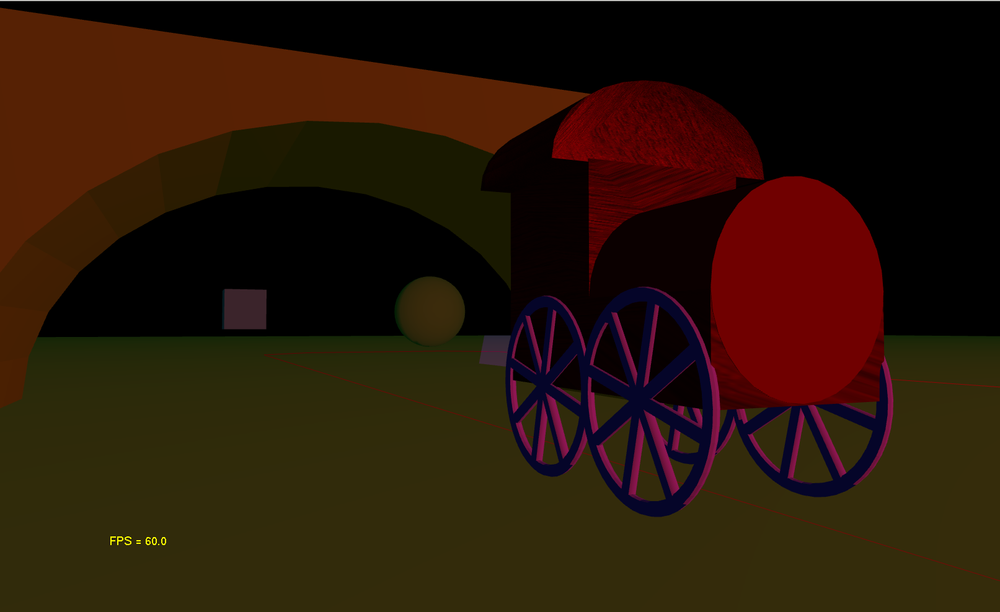

# Introduction to Computer Graphics

This is my project for the module Introduction to Computer Graphics.
This was the first Computer Graphics University Module.
This project is based on the Introduction to Computer Graphics template.
This is a fixed function OpenGL project.
The wood texture for the train is from http://diegrammlichs.de/innenausbau/holzkunde/.

# How to compile
* Clone repository `git clone`
* Open either:
  * `Template_PrakCG.sln` with _Visual Studio_
  * `Template_PrakCG.cbp` with _Code::Blocks_

# Features
The scene is made out of multiple features required for the assignment:
* The ground plane out of generated quadrics `glBegin(GL_QUADS)`
* Sphere, Cube and a Cone
* A pyramid built out of triangle primitives `glBegin(GL_TRIANGLES)`
* An obj train with wood-texture and a obj bridge
* 2 transparent triangles
* 3 lights (directional, red pointlight, spotlight of the train)
* 4 cameras: orbit-camera, overhead camera, stationary camera, train camera
* Path of the train represented by `glBegin(GL_LINE_LOOP)`

The train moves with the left arrow key, the longer the key is pressed the
faster the train moves.
The application models the path as an array of vectors, which the train
moves along.

# Controls
* H - help text and keys as provided by the template
* Z - change the camera
* M - switch light
* +/-/*/_ - right/left/up/down for the overhead camera
* -> - moves the train forward
